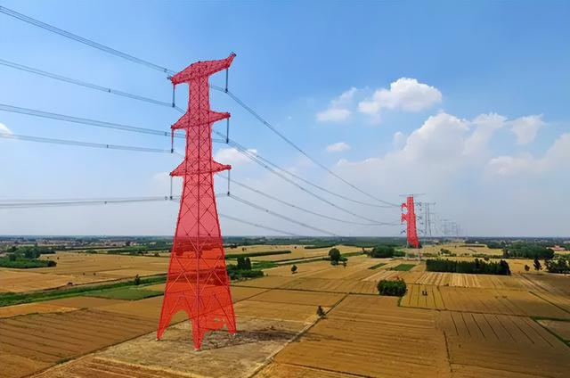

# 🚀概述
[english](README_en.md)

基于[LISA](https://github.com/dvlab-research/LISA)，实现了使用数据集[LabPicsV1](https://zenodo.org/records/3697452/files/LabPicsV1.zip?download=1)进行分割任务微调、预测、评估等。配置方法下面有，也可以参见[老文档](README_origin.md)




# 🚀配置

安装库（可以先整一个虚拟环境），大部分库版本要对，要不然很容易报错，特别是transformers、gradio、numpy这些，其他库实在不行装新版试试。
```bash
pip install -r requirements.txt
pip install flash-attn --no-build-isolation
```

# 🚀下载权重

下载权重，以下是比较新的，可以选7B或者13B（本文用的7B，因为4090D显存刚好不够跑bf16的13B），放到自定义的位置。其中LISA应该是直接包含LLaVA和SAM的，也就是网络结构当中的全部。如果只是预测和评估就只需要下载LISA和LLaVA视觉主干（理论上第二个不用下，但是代码里面似乎是单独读取权重的）；如果要微调就需要LISA（或LLaVA）、LLaVA视觉主干、SAM-VIT-H。

- LISA：https://huggingface.co/xinlai/LISA-7B-v1
- LLaVA视觉主干：https://huggingface.co/openai/clip-vit-large-patch14
- LLaVA：https://huggingface.co/liuhaotian/LLaVA-Lightning-7B-delta-v1-1
- SAM-VIT-H：https://dl.fbaipublicfiles.com/segment_anything/sam_vit_h_4b8939.pth

下载完成后，打开LISA权重文件夹中的 config.json 文件，里面的 vision_tower 的路径应当改成视觉主干文件夹的路径。

# 🚀项目结构
以下是新增或者有改动的部分：
- myutils：
    - dataset.py：LabPicsV1的dataset类；
    - metric.py：评估指标，有IoU、GIoU、CIoU、Dice、PA、Boundary F1；
- merge_lora_weights_and_save_hf_model.py：把微调后的权重转换为完整的LISA权重；
- test.py：利用metric.py的指标在LabPicsV1数据集对模型进行评估；
- train.py：使用LabPicsV1数据集训练LISA。

# 🚀使用方法
- 对话和预测：运行 chat.py 或 app.py
- 评估：运行 test.py
- 微调：
    1、运行 train.py 进行微调；
    2、运行 `cd ./runs/lisa/ckpt_model && python zero_to_fp32.py . ../pytorch_model.bin` 获得完整LISA权重；
    3、运行merge_lora_weights_and_save_hf_model.py进行LoRA权重合并，得到huggingface格式的权重；
