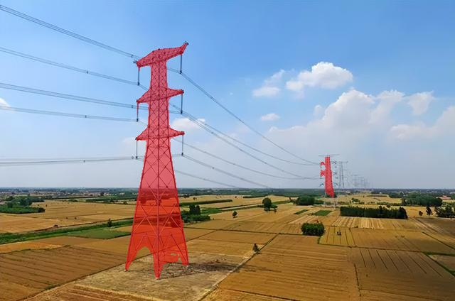
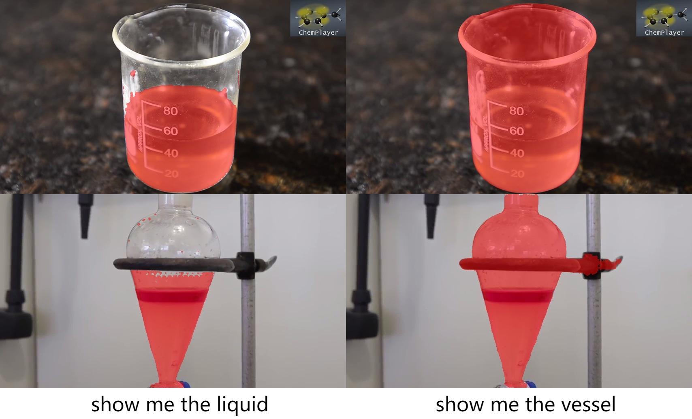

# 🚀 Overview
[中文](README.md)

Based on [LISA](https://github.com/dvlab-research/LISA), this project implements fine-tuning, prediction, and evaluation tasks on the [LabPicsV1](https://zenodo.org/records/3697452/files/LabPicsV1.zip?download=1) dataset. Setup instructions are provided below and in the [original README](README_origin.md).

The LISA dataset is also used for training, with improvements introduced in this project.





# 🚀 Setup

Install the required libraries (it's recommended to use a virtual environment). Pay close attention to version compatibility, especially for `transformers`, `gradio`, and `numpy`, as mismatched versions can easily cause errors. For other libraries, try newer versions if you encounter issues.

```bash
pip install -r requirements.txt
pip install flash-attn --no-build-isolation
```

# 🚀 Download Weights

Download model weights. The following are relatively recent options. You can choose between 7B and 13B models (this project uses 7B because the 4090D GPU doesn’t have enough VRAM to run the 13B model with bf16). Place the models in custom directories.  
LISA includes both LLaVA and SAM components, meaning it covers the entire architecture.  
If you only want to run inference or evaluation, you only need LISA and the LLaVA vision backbone (in theory, the second one isn’t necessary, but the code seems to load it separately).  
For fine-tuning, you will need LISA (or LLaVA), the LLaVA vision backbone, and SAM-VIT-H.

- **LISA**: https://huggingface.co/xinlai/LISA-7B-v1  
- **LLaVA Vision Backbone**: https://huggingface.co/openai/clip-vit-large-patch14  
- **LLaVA**: https://huggingface.co/liuhaotian/LLaVA-Lightning-7B-delta-v1-1  
- **SAM-VIT-H**: https://dl.fbaipublicfiles.com/segment_anything/sam_vit_h_4b8939.pth

After downloading, open the `config.json` in the LISA model folder and update the `vision_tower` path to point to your local vision backbone directory.

# 🚀 Project Structure

- `model/`: Core implementation of LISA, including LISA, LLaVA, and SAM.
- `myutils/`:  
    - `dataset.py`: Dataset class for LabPicsV1.  
    - `metric.py`: Evaluation metrics including IoU, GIoU, CIoU, Dice, PA, and Boundary F1.  
    - `occupy.py`: Memory occupation test.  
    - `test_device.py`: GPU availability test.  
    - `test_zerostage.py`: Test Deepspeed Zero performance.  
    - `zero1_to_fp32.py`: Convert Zero1-trained weights to fp32.

- `utils/`: Preprocessing tools for the LISA dataset.  
- `app.py`: Interactive Gradio-based interface for LISA visualization.  
- `chat.py`: Dialogue-based interaction and prediction with LISA.  
- `merge_lora_weights_and_save_hf_model.py`: Merge LoRA fine-tuned weights into a complete LISA model in HuggingFace format.  
- `test.py`: Model evaluation on LabPicsV1 using metrics from `metric.py`.  
- `train_ds.py`: Training using the LISA dataset.  
- `train.py`: Training using the LabPicsV1 dataset.

# 🚀 How to Use

- **Inference & Chat**: Run `chat.py` or `app.py`.  
- **Evaluation**: Run `test.py`.  
- **Fine-tuning**:  
    1. Run `train.py` or `train_ds.py` to fine-tune.  
    2. For Deepspeed Zero2, run:  
       ```bash
       cd ./runs/lisa/ckpt_model
       python zero_to_fp32.py . ../pytorch_model.bin
       ```  
       For Zero1, run `zero1_to_fp32.py`.  
    3. Run `merge_lora_weights_and_save_hf_model.py` to merge LoRA weights and save in HuggingFace format.
